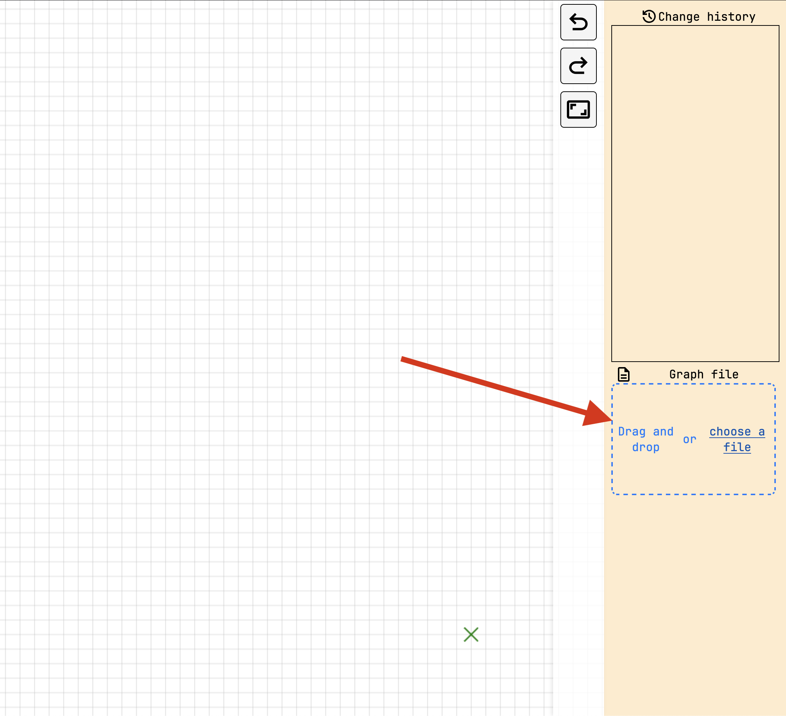

# User Guide: Grapher


## 0. Work Log
Excpected working:
1. Fully editing the graph - moving the vertices, drawing edges, everything
2. editing the graph in crossing-free mode - it should be impossible to make a crossing.
3. entering matchings mode if the graph is a perfect matching
    * click on an edge, all edges with which a flip could be performed are now red, and the clicked edge is green
    * click on one of the red edges, all other edges go back to black, and green lines are drawn for where the new lines would be drawn
    * click on one of the green lines, the flip is perfromed
    * the flip can be undone and re-done via history (ctrl+z or button)
    * in the matcings mode, only flips can be undone/redone
4. entering triangulations mode if the graph is a geometric triangulation
    * click on an edge
        - if it's on the outer hull, or no valid flip with it can be performed, a notification should appear informing the user of this
        - otherwise, if it's a flippable edge, the flip should get indicated (or insta-flipped)
    * click on a vertex
        - see available vertexes that can be used for a new edge that would be valid flips highlighed as yellow
        - click on one, if insta-flip is enable it should flip, otherwise click the green edge to confirm
5. entering crossing-free spanning PATHs mode if the graph is a CFSP
    * unfortunately, clicking an edge shows invalid flips as possible for now - work in progress
6. highlighting of colinear points
    * it's a toggle, so it needs to be turned off. It obstructs visibility for flipping
7. settings
    * adjusting the hover/click proximity, colors, and by what factor the coordinates get multiplied
    * adjusting the size of the vertices and edges in pixels (slider)
8. coordinate multiplaction
    * it's at the bottom of the top part of the toolbar (icon is like small markers pointing diagonally)
9. re-zoom graph so that it's fully within the canvas
10. insta-flip toggle for perfect matchings and triangulations
    * insta-flip toggle is at the very bottom of the settings view


Expected not working:
1. other flip types (almost-perfect matchings, CFSP, CFST)
2. show all possible flips button/toggle
3. insta-flip toggle for other modes(almost-perfect matchings, CFSP, CFST)

Note: Spiral graph with only 3 possible flips for matchings (with 3 'levels') can be found in data/matchings_only_3_flips_spiral_graph.txt


## 1. Introduction

### 1.1 Purpose: This is Grapher, an interactive web-app for investigating graph reconfigurations! The primary motivation for this tool is to help us explore graph *reconfigurations* for a few main types of geometric graphs.

* Configurations are plane drawings of straight line graphs with labeled vertices
* A reconfiguration step, or a flip, is an exchange of (a bounded number of) edges
### 1.2 Supported Graph Types for reconfiguration:
* Perfect Pairings / Matchings
* Almost-Perfect Pairings / Matchings
* Crossing-Free Spanning Trees
* Crossing-Free Spanning Paths
* Triangulations
### 1.3 Target Audience: Researchers, students, and anyone interested in exploring the structural properties and transformations of these specific graph classes.

## 2. Getting Started

### 2.1 Accessing the Tool:

An instance of the tool is hosted on [GitHub pages](https://hash-crash.github.io/Grapher/).

The source code can also be found on [Github](https://github.com/hash-crash/Grapher). After cloning the repository, using the tool is as simple as opening the index.html file in the 'root' directory. Alternatively, the Live Server extension for VSCode can be used to speed up development (by default, it makes the tool accessible through [localhost](http://127.0.0.1:5500/index.html)).


### 2.1 Requirements:
* A mouse or touchpad 
* A modern web browser

## 3. Interface Overview

The tool interface is divided into several key areas:

* **3.1. Graph Area (Canvas):**
    * The central panel where the graph is visually displayed.
    * All direct graph manipulations (adding/moving nodes, adding/removing edges) happen here.
    * Uses a grid background for reference.
* **3.2. Canvas toolbars :**
    * Contain buttons to switch between interaction modes or perform global actions.
    * Main interactables:
        * `[Icon 5 - Interconnected dots/graph]` - Allows the user to switch between 'usage modes' - These include reconfigurations of each specific graph type, as well as unrestricted editing and crossing-free editing.
* **3.3. Right Sidebar:**
    * **3.3.1. Change History:**
        * Displays a chronological list of actions performed (e.g., "Add vertex", "Import file", "Add edge").
        * Allows navigation through the history using Undo/Redo, as well as jumping to any of the states in the history/undone sections.
        * Each entry in the history section stores the state of the graph that occurs after the change that it's describing is applied (indicated by the highlight line appearing under the list item)
        * Dynamically updates as you modify the graph.
    * **3.3.2. File Contents:**
        * Shows a live representation of the current graph state in the supported [file format](#6-file-handling).
        * Displays Vertex count and Edge count.
        * Lists vertex coordinates.
        * Lists edge connections (using 1-based indexing).
        * Hovering over vertices and edges will highlight them, cliking on a line will select them
        * Double-clicking on a line will allow the user to edit it (changing the coordinates of a vertex i.e. which vertices an edge connects)
        * Buttons:
            * `Clear`: Removes the current graph.
            *  `[Download Icon]`: Downloads the current graph as a text file in the supported format.
            *  `[Copy Icon]`: Copies the current graph data (in the supported format) to the clipboard.
* **3.4. Status Messages:**
    * Appear in the bottom-left corner of the screen.
    * Provide feedback on actions or system status.
    * **Blue Messages:** Informational (e.g., "File imported successfully").
    * **Red Messages:** Indicate errors or problems (e.g., "Graph is not a valid Spanning Tree", "Invalid file format").
    * Messages disappear automatically after a few seconds.

## 4. Basic Workflow: Creating & Editing Graphs

You can start with a graph in two ways:

* ### 4.1. Importing a Graph:
    * Use the file selector button or drag and drop a valid graph file onto the indicated box.
    
     

    * The tool only supports a specific plain text format (see [Section 6](#6-file-handling)).
* ### 4.2. Building a Graph from Scratch (Edit Mode):
    * Ensure you are in 'Edit Mode' (See [Toolbar-modes](#8-toolbar-actions) and [Graph types](#12-supported-graph-types-for-reconfiguration))
    * **Selecting Elements:**
        * Left-click a vertex or an edge to select it. Selected elements are rendered in a blue color.
        * Selection is used for actions like deleting or starting edge creation.
    * **Adding Vertices:** 
        * Right-click on an empty space in the Graph Area, then select 'Add vertex'. A new vertex will appear at that location.
        * If a vertex is already selected, you also have the option to 'Add vertex and draw edge'. This allows quickly drawing paths.
    * **Adding Edges:**
        1.  Left-click on the first vertex (it should become selected - rendered in a blue color).
        2.  Right-click on the second vertex.
        3.  Select "Draw edge to here" from the context menu.
    * **Moving Vertices:** 
        * Click and drag a vertex to a new position. The mouse pointer will change to a 'grab' or 'grabbing' hand icon.
        * The vertex will snap to the nearest coordinate once you let go.
    * **Removing Vertices:**
        1.  Right-click on the vertex you want to remove.
        2.  Select "Remove vertex" from the context menu.
            *  *Note:* This will also automatically remove all edges connected to that vertex.
    * **Removing Edges:**
        1.  Right-click on the edge you want to remove.
        2.  Select "Remove edge" from the context menu.
    * **Deselecting:** Press the `Escape` key or click on empty space to clear any current selection.
    * **Panning/Zooming:** 
        1. To pan, simply use the mouse to drag the canvas. Grab anywhere except a vertex, the mouse pointer will change to a 'move' icon.
        2. To zoom, use the use the scroll wheel. The tool will always zoom towards where the mouse is positioned. The vertices will always be rendered the same size, allowing you to have an easier time adjusting graphs where vertices are close to each other.

## 5. Performing Reconfigurations

This is the core feature for exploring graph transformations while maintaining specific structural properties.

* **5.1. Pre-requisite: Valid Graph:** Ensure the graph currently displayed in the canvas conforms to the desired graph type (e.g., is a valid Crossing-Free Spanning Tree) *before* attempting reconfiguration for that type.
* **5.2. Select Graph Type:** Choose the graph type you want to work with (toolbar,  graph-mode icon, then click on the desired type). The tool will verify if the current graph matches the selected type. If not, an error message will appear.
* **5.3. Initiate reconfigurations:** The method depends on the selected graph type:
    * **For  Almost-Perfect Matchings:**
        * **Option A (Edge-based):** Select **one** existing edge. The tool will highlight potential alternative edges that could replace the selected one while maintaining the graph type.
        * **Option B (Vertex-pair-based):** Select **two** vertices that do *not* currently have an edge between them (representing a *candidate* edge). The tool will highlight existing edges that could be removed if this candidate edge were added, maintaining the graph type.


## 6. File Handling

* **6.1. Supported File Format:**
    * Plain text file. (`.txt` usually, but extensions are ignored)
    * **Line 1:** Contains two integers: `number_of_vertices` `number_of_edges`.
    * **Lines 2 to `number_of_vertices + 1`:** Each line contains the  `x y` coordinates for a vertex.
    * **Following `number_of_edges` lines:** Each line contains two integers `u v`, representing the **1-based indices** of the vertices connected by an edge.
        * Note: In each line, the numbers can be separated by whitespace, comma, or semicolon (JS-regex: `/\s|,|;/`)

    *Example:*
    ```text
    4 3
    0 0
    10 0
    10 10
    0 10
    1,2
    2;3
    3       4
    ```
    *(This represents a square with 4 vertices and 3 edges connecting V1-V2, V2-V3, V3-V4)*

* **6.2. Importing:** Use the file input or drag-and-drop (See Section 4.1). Invalid formats will trigger an error message.
* **6.3. Exporting/Viewing:** Use the 'File Contents' panel in the right sidebar to view the current graph data, download it as a `.txt` file, or copy it to the clipboard.
* **6.4. Your Data** Grapher runs entirely in your web browser. Any data you import or otherwise input will not be sent to any server, and no cookies are used. 

    * Note: The most recent graph is saved to [Local Storage](https://developer.mozilla.org/en-US/docs/Web/API/Window/localStorage) as a best-effort means of combatting data loss.

## 7. Change History & Undo/Redo

* The "Change History" panel lists all modifications made during the session.
* Use standard keyboard shortcuts to navigate history:
    * `Ctrl+Z` (Windows/Linux) or `Cmd+Z` (Mac): Undo the last action.
    * `Ctrl+Shift+Z` (Windows/Linux) or `Cmd+Shift+Z` (Mac): Redo the last undone action.
* Clicking on history list entries jumps to the state of the graph that ensues after the described change was applied.


## 8. Toolbar actions

The toolbar contains buttons that permit interacting with the program. The main usage is outlined here:
* **Undo/Redo** button go through [History](#7-change-history--undoredo)
* **Resize canvas coordinates** will adjust the zoom and move the view so that the entire current graph appears on the screen
* **Explode coordinates** will multiply every vertex' coordinates by a fixed amount (by default, 4). This is useful in case the current graph gets too cluttered. 
* **Show all colinear vertices** will draw red lines between any 3 vertices that are colinear. It can be useful for finding crossings. It's a toggle, and it's turned off by clicking the button again
* **Change target graph type** opens a modal with which the program can be adjusted for specific graph types.
    * Standard editing is described in [Building a graph](#42-building-a-graph-from-scratch-edit-mode)
    * Non-crossing editing is the same, with the additional rule that crossings can't be created
    * The other modes are flip modes, listed under [Supported graph types](#12-supported-graph-types-for-reconfiguration), and described under [Performing reconfigurations](#5-performing-reconfigurations)


## 9. Keyboard Shortcuts

* **Undo:** `Ctrl+Z` / `Cmd+Z`
* **Redo:** `Ctrl+Shift+Z` / `Cmd+Shift+Z`
* **Delete Selected:** `Delete` or `Backspace` (when a vertex or edge is selected in Edit Mode).
* **Deselect:** `Escape`
* **Clear the file** Ctrl+K 
* **Mode switching**
    -  `R` for entering whichever mode is applicable to the current graph type (if any) - so, if the graph is a matching, it will enter matchings mode, and if it's a triangulation, it will enter triangulation mode, etc.
    - `E` for entering EDIT mode
    - `G` for entering Triangulation mode if possible
    - `P` for entering Paths mode if possible
    - `M` for entering Matchings mode if possible


## 10. Troubleshooting / FAQ

* **Q: Why can't I import my file?**
    * A: Check if it strictly follows the format described in [Section 6.1](#6-file-handling). Ensure vertex indices for edges are 1-based, not 0-based. Verify the vertex and edge counts on the first line match the actual data.
* **Q: Why does the tool say my graph isn't a valid [Graph Type] when trying reconfiguration?**
    * A: Ensure your graph strictly meets the definition of the selected type (e.g., a spanning tree must connect all vertices with no cycles, a perfect matching must cover all vertices exactly once, geometry constraints like non-crossing might apply). Correct the graph in Edit Mode first. Worst case, a more useful error message might be logged in the browser console (usually accessed via `F12`)
